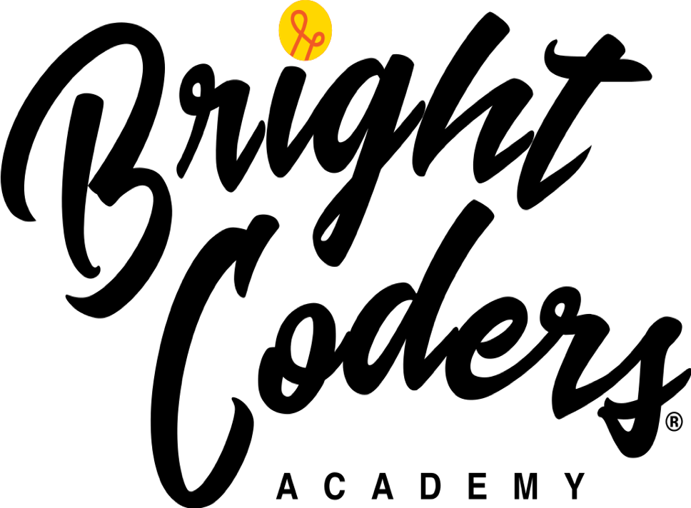

# Programación Web (HTML+CSS+JS)

Mediante este ejercicio queremos conocer tus habilidades de programación utilizando HTML+CSS+JS.

No vamos a evaluar que tan experto eres, sino lo que buscamos es comprobar que tienes las bases necesarias para poder aprovechar al máximo nuestro program

## Instrucciones

- Para evaluar estas habilidades utilizaremos un ejercicio tomado de la página [Frontend Mentor](https://www.frontendmentor.io/).

# Evaluación

- Evaluaremos la apariencia de la página, es decir que tan similar es diseño solicitado.
- Revisaremos el uso de HTML+CSS+JS que generaste.
- La página debe ser responsiva, por eso se proporciona tanto el diseño móvil como el de escritorio
- No es necesario utilizar algún framework en particular, pero si necesitas hacerlo no hay problema.

# El Reto - Fylo landing page with two column layout

## Welcome! 👋

Thanks for checking out this front-end coding challenge.

[Frontend Mentor](https://www.frontendmentor.io) challenges allow you to improve your skills in a real-life workflow.

**To do this challenge, you need a basic understanding of HTML and CSS.**

## Where to find everything

Your task is to build out the project to the designs inside the `/design` folder. You will find both a mobile and a desktop version of the design to work to.

The designs are in JPG static format. This will mean that you'll need to use your best judgment for styles such as `font-size`, `padding` and `margin`. This should help train your eye to perceive differences in spacings and sizes.

You will find all the required assets in the `/images` folder. The assets are already optimized.

There is also a `style-guide.md` file, which contains the information you'll need, such as color palette and fonts.

## Building your project

Feel free to use any workflow that you feel comfortable with. Below is a suggested process, but do not feel like you need to follow these steps:

1. Look through the designs to start planning out how you'll tackle the project. This step is crucial to help you think ahead for CSS classes that you could create to make reusable styles.
2. Before adding any styles, structure your content with HTML. Writing your HTML first can help focus your attention on creating well-structured content.
3. Write out the base styles for your project, including general content styles, such as `font-family` and `font-size`.
4. Start adding styles to the top of the page and work down. Only move on to the next section once you're happy you've completed the area you're working on.

**Have fun building!** 🚀
# bc-reto2-programacionWeb
